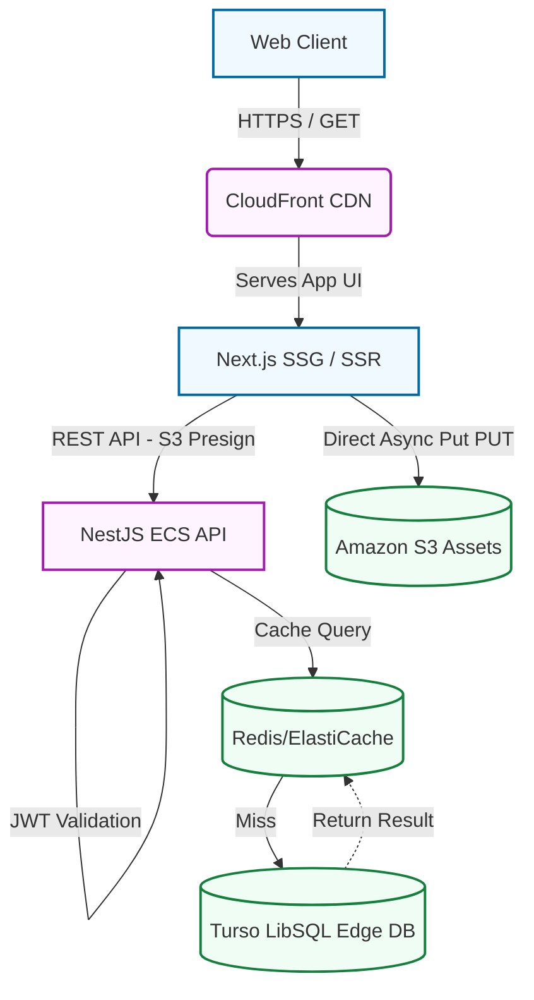

# Organizer Hub Enterprise Boilerplate 🚀
<!-- Final E2E Deployment Test: 2026-03-14T17:40:41+05:30 -->

Welcome to the Organizer Hub V2! This repository defines a **Production-Ready, Monorepo Architecture** utilizing Domain-Driven Design (DDD) to govern Next.js frontend rendering, NestJS REST API orchestration, and AWS Infrastructure parameters.


*Visualizing the Feast: The premium Festival Explorer interface delivering real-time event updates and cultural enrichment.*

## 🛠️ The Tech Stack

This framework leverages a strictly typed `Turborepo` architecture for instantaneous UI/Backend builds.

### Frontend (`apps/web`)
- **Next.js 14** (App Router) for Server-Side Rendering & SEO indexing.
- **React 18** paired with TanStack **React Query** for async state management and caching.
- **Tailwind CSS** + **Shadcn UI** for dynamic, responsive presentation layers.

### Backend (`apps/api`)
- **NestJS** configured via CQRS (Command Query Responsibility Segregation) event buses.
- **Domain-Driven Design (DDD)** segregating core business logic from database schema constraints.
- **Prisma ORM** mapping onto **Turso (LibSQL)** for global low-latency data access.
- **Redis (cache-manager)** aggressively caching `/festivals` GET endpoints.
- **Winston / Pino** integrated globally via `AllExceptionsFilter` for centralized CloudWatch telemetry parsing.

### Cloud Infrastructure (`infra`)
- Defined strictly via **AWS CDK (TypeScript)** yielding consistent, reproducible deployment environments:
  - Frontend: **S3** + **Amazon CloudFront** distribution.
  - Compute: **Amazon ECS Fargate** executing Node 20 containers.
  - Persistence: **Turso / LibSQL** (Edge Database) + **Amazon ElastiCache** (Redis).


*Cloud Native Persistence: Turso LibSQL instance managing organization and festival data at the edge.*

> [!TIP]
> **Virtual S3 Provider**: For local development, the application uses a "Virtual S3 Provider." If the API detects placeholder AWS keys in the `.env` file, it bypasses the literal AWS SDK and serves a local `UploadsController` proxy. This saves cloud compute costs and enables 100% offline verification.

## 🧭 System Architecture Flow

The system utilizes highly decoupled boundaries avoiding bottlenecks during heavy traffic.



## 🚀 Quick Start (Local Development)

1. **Clone Repository**.
2. **Setup Dependencies**: Ensure you have Node `v20`. Install turbo: `npm install -g turbo`. Run `npm install` at the root.
3. **Doppler Configuration**:
   - Install [Doppler CLI](https://docs.doppler.com/docs/install-cli).
   - Run `doppler login`.
   - Run `doppler setup` to link your local environment to the project.
4. **Initialize Schema (Turso)**:
   ```powershell
   doppler run -- npx ts-node apps/api/apply_schema.ts
   ```
5. **Generate Prisma Client**:
   ```powershell
   npx prisma generate
   ```
6. **Seed Database**:
   ```powershell
   doppler run -- npm run db:seed
   ```
7. **Launch Project**: At the root, run `doppler run -- npx turbo run dev`.
8. Navigate to `http://localhost:3000`.

## 🤖 CI/CD & Autodeploy

This project uses **GitHub Actions** for automated builds and deployment.

### Deployment Secrets
To enable automated deployments, add the following secrets to your GitHub repository:

| Secret | Description |
| --- | --- |
| `DOPPLER_CONFIG_STG_TOKEN` | Doppler Service Token for Staging (`stg`) |
| `DOPPLER_CONFIG_PRD_TOKEN` | Doppler Service Token for Production (`prd`) |
| `VERCEL_TOKEN` | Your Vercel Personal Access Token |
| `VERCEL_ORG_ID` | Your Vercel Team/Organization ID |
| `VERCEL_PROJECT_ID` | Your Vercel Project ID |
| `RAILWAY_STG_TOKEN` | Railway API Token for Staging project |
| `RAILWAY_PRD_TOKEN` | Railway API Token for Production project |

The workflow in `.github/workflows/deploy.yml` automatically triggers:
- **Staging**: On push to `develop` branch.
- **Production**: On push to `main` or `master` branches.

## 📚 Technical Handover

If you're jumping in to tackle new features, please consult the enclosed manuals:
- [CONTRIBUTING.md](./CONTRIBUTING.md) dictates GitFlow branch naming.
- [CODE_REVIEWS.md](./CODE_REVIEWS.md) highlights PR integration checks.
